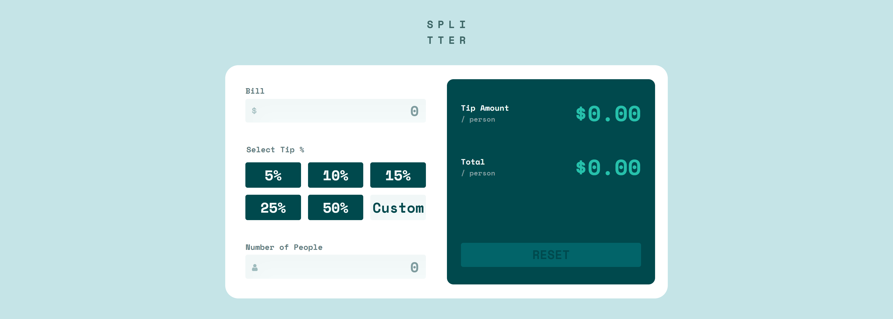
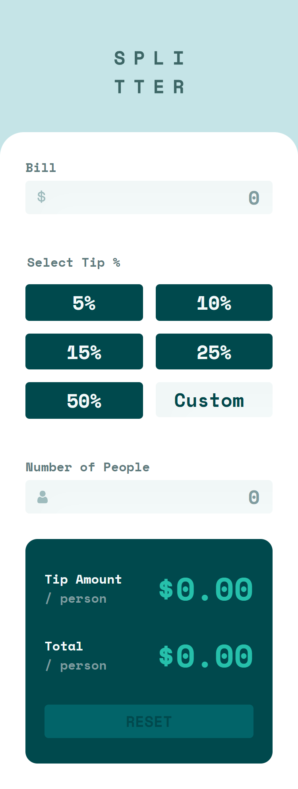

# Frontend Mentor - Tip calculator app solution

This is a solution to the [Tip calculator app challenge on Frontend Mentor](https://www.frontendmentor.io/challenges/tip-calculator-app-ugJNGbJUX). Frontend Mentor challenges help you improve your coding skills by building realistic projects.

## Table of contents

- [Overview](#overview)
  - [The challenge](#the-challenge)
  - [Screenshot](#screenshot)
  - [Links](#links)
- [My process](#my-process)
  - [Built with](#built-with)
  - [What I learned](#what-i-learned)
  - [Continued development](#continued-development)
  - [Useful resources](#useful-resources)
- [Author](#author)


## Overview

### The challenge

Users should be able to:

- View the optimal layout for the app depending on their device's screen size
- See hover states for all interactive elements on the page
- Calculate the correct tip and total cost of the bill per person

### Screenshot





### Links

- Solution URL: [Code](https://github.com/tan911/Tip-calculator-app)
- Live Site URL: [Live site](https://tan911.github.io/Tip-calculator-app/)

## My process

### Built with

- Semantic HTML5 markup
- CSS custom properties
- Flexbox
- CSS Grid
- Desktop-first workflow
- Javscript
- Sass/scss
- BEM methodology


### What I learned

There is a lot of consideration  while building this application, but I'm focusing the functionality of this one  


To begin the structure, 

Considering it sematically, I'm always use semantic elements rather than putting it role attribute into div element

```html
<body>
  <main>
    <div>
      <h1><svg>Logo</svg></h1>
    </div>
    <div>input</div>
    <div>output</div>
  <main>
<body>
```
and to make the content centered both horizontally and vertically I use flexbox for body elements

```css
body {
  display: flex;
  align-items: center;
  justify-content: center;  
}
```
if you are wondering why I use h1 element for the logo, this to prevent getting error from accessibility, I'll wrap the logo with a level 1 heading and added and inline elements into it with the text "splitter". buy why tho? Since our logo is nothing but a decorative and still want to be accessible by screen readers(people who use assistive technology to operate your site) We have to use aria attributes. 

by adding [aria-labelledby](https://developer.mozilla.org/en-US/docs/Web/Accessibility/ARIA/Attributes/aria-labelledby) to your h1 with the value of 'title'  and then add an 'id' of your span element with the same value. 

```html
  <h1 aria-labelledby="title">
    <span id="title">splitter</span>
  </h1>
```
But what we want is to only display the logo without the text right? So I hide it via [visually-hidden](https://www.a11yproject.com/posts/how-to-hide-content/) class. Also adding aria-hidden="true", and focusable="false" attribute for the logo hence this is just a decorative.

```html
  <h1 aria-labelledby="title">
    <span class="visually-hidden" id="title">splitter</span>
    <svg aria-hidden="true" focusable="false"></svg>
  </h1>
```

I'm having a lot of fun building the functionality of this app, sometimes I included more 'What if scenarios in there' to be able to come up reliable output. The main idea of this application is to calculate the tip of the given input

bill input - inputting amount of your bill
tip / custom tip - inputting your prefered tip 
number of people - inputting numbers of people you want add tip

However I use 3 different type of inputs 

type = radio : if you have buttons that will give input a value then type radio is more preferrable as it contain accessibility rather than natural button

type = number : I use this for custom input so that user will input only a number

type = text : although I only need numbers and the user might be able to enter text but javscript will handle this validation

I categorize these 3 inputs into 2 for the looping

Everytime a user will click the buttons or the inputs the value of these will pass to respective function that will handle the some instruction before calculating the output.

```js
// for radio buttons
for(let i = 0; i < tipBtn.length; i++) {
    tipBtn[i].addEventListener('click', () => {
        const percent = tipBtn[i].querySelector('label').textContent;
        selectedTipAmount(percent);
    })
}

// for text and number inputs
for(let k = 0; k < userInput.length; k++) {
    userInput[k].addEventListener('change', (e) => {
        if(!tipBtn[k].checked && customTipInput.value.length === 0) {
            displayMessage('success');
        } else {
            tipPerPersonAmount(e.target.value);
        }   
    })
}
```

During the development there is called what if and I'm trying to act as user, Now let's talk about what if, caught some bugs and how I address it.

What if the user will input text and not number and accidentally not inputting one the inputs?
So to address this I used 'guard' inside the calculations, and what the guard do?

It simply have conditions and if this one of these condition is true simply terminate the function and to be specific 'do nothing'

These condtions are if: 
- if the input is covertable by number
- if the input is empty 

```js
  // guard
  if(isNaN(+numberOfPeople.value) || +numberOfPeople.value === 0) return;
```
another what if and these what if leads to bugs of my application: 
- If the user start to give an input from the buttom or the middle and so on
- if the user already give an custom input then switch to another input (radio buttons)

For instance, the user will start to type custom input then bill input, number of people then the output of this is not correct as expected. The same as when the user already give a custom input(ex. 80 tip) and then switch to another tip(ex. 5 tip).   

So to fix this bugs I used the advantage of ternary operator and a very handy of coverting a string into number
```js
    const fixedInput = +input === +numberOfPeople.value || +input === +billAmount.value ? +customTipInput.value : +input;  
    const toInput = customTipInput.value === '' ? +input : fixedInput;
    const percentage = (toInput / 100) * +billAmount.value;
```

the first line 'fixedInput' will have a value base on the given condition, so if the given conditions is meet then value of this will be custom input otherwise the value will be the input choice(ex. 5, 10, 15, 25, 50)
```js
 const fixedInput = +input === +numberOfPeople.value || +input === +billAmount.value ? +customTipInput.value : +input;  
```

### Continued development

Use this section to outline areas that you want to continue focusing on in future projects. These could be concepts you're still not completely comfortable with or techniques you found useful that you want to refine and perfect.


### Useful resources

- [](https://www.example.com) - This helped me for XYZ reason. I really liked this pattern and will use it going forward.
- [Example resource 2](https://www.example.com) - This is an amazing article which helped me finally understand XYZ. I'd recommend it to anyone still learning this concept.

## Author

- Website - [Add your name here](https://www.your-site.com)
- Frontend Mentor - [@yourusername](https://www.frontendmentor.io/profile/yourusername)

